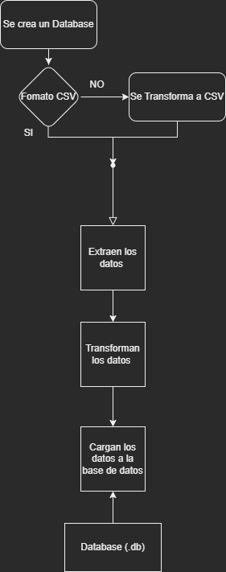
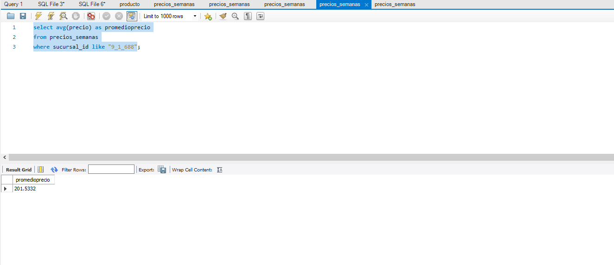

# Proyecto Individual 1- Data 04- Soy Henry   
## Data Engineering

## Introduccion
En este primer proyecto presentado en la ultima etapa de la carrera DataScience del Bootcamp de Henry, este proyecto esta relacionado a Data Engineering. 

Habilidades:
 - Proceso ETL (Extraccion, Transformar y Cargar datos)
 - Crear un Databse en MySql donde se almacena todos los datos
    
## Entre las Herramientas se encuentran:
 - Jupyter Notebooks, Python, Mysql, SQL.
 - Uso de Librerias de Python: SQLAlchemy, Numpy, Pandas

## Propuesta
- Procesar los diferentes datasets. 
- Crear un archivo DB con el motor de SQL que quieran. Pueden usar SQLAlchemy por ejemplo.
- Realizar en draw.io un diagrama de flujo de trabajo del ETL y explicarlo en vivo.
- Realizar una carga incremental de los archivos que se tienen durante el video.
- Realizar una query en el video, para comprobar el funcionamiento de todo su trabajo. La query a armar es la siguiente: Precio promedio de la sucursal 9-1-688.

## Procesos 
- Primero se transforman los datos a formato CSV
- Luego se cargan los archivos como dataframes y se realiza una limpieza u normalización de datos
- Se crea un Dataframe en Mysql y se cargan las diveras tablas

Una vez cargados los datos se puede realizar consultas Query y su futuro análisis 

## Diagrama de flujo

## Respuesta

Se realiza una consulta Query: 'Precio promedio de la sucursal 9-1-688' en el DataBase

